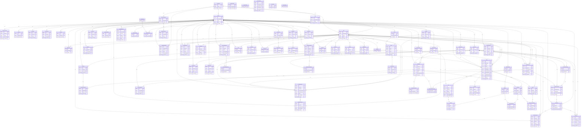

# Database Diagram

Generated from `apps/backend/prisma/schema.prisma` (PostgreSQL, 79 models). Columns shown: keys, name, status, createdAt.

```mermaid
erDiagram
  Branch ||--o{ Attendance : has
  Branch ||--o{ BankTransaction : has
  Branch ||--o{ Budget : has
  Branch ||--o{ Campaign : has
  Branch ||--o{ CashClosing : has
  Branch ||--o{ Coupon : has
  Branch ||--o{ Customer : has
  Branch ||--o{ DeliveryZone : has
  Branch ||--o{ Document : has
  Branch ||--o{ Equipment : has
  Branch ||--o{ Expense : has
  Branch ||--o{ Floor : has
  Branch ||--o{ GiftCard : has
  Branch ||--o{ GoodsReceipt : has
  Branch ||--o{ Ingredient : has
  Branch |o--o{ IntegrationApiKey : has
  Branch ||--o{ KitchenStation : has
  Branch ||--o{ LeaveRequest : has
  Branch ||--o{ MenuCategory : has
  Branch ||--o{ MenuItem : has
  Branch ||--o{ ModifierGroup : has
  Branch ||--o{ Notification : has
  Branch ||--o{ Order : has
  Branch ||--o{ PayrollRun : has
  Branch ||--o{ Promotion : has
  Branch ||--o{ PurchaseOrder : has
  Branch ||--o{ PurchaseRequest : has
  Branch ||--o{ ReportSchedule : has
  Branch ||--o{ Reservation : has
  Branch ||--o{ Shift : has
  Branch ||--o{ StockBatch : has
  Branch ||--o{ StockMovement : has
  Branch ||--o{ Supplier : has
  Branch ||--o{ SupplierInvoice : has
  Branch ||--o{ SupplierPayment : has
  Branch ||--o{ SupplierQuotation : has
  Branch ||--o{ UserBranch : has
  Branch ||--o{ VerifactuRecord : has
  Branch ||--o{ VerifactuSettings : has
  Branch ||--o{ WaitlistEntry : has
  Branch ||--o{ WasteLog : has
  Customer |o--o{ GiftCard : has
  Customer |o--o{ Order : has
  DeliveryZone |o--o{ Order : has
  Document ||--o{ DocumentFile : has
  Equipment ||--o{ ServiceLog : has
  Floor ||--o{ Table : has
  GiftCard ||--o{ GiftCardRedemption : has
  GoodsReceipt ||--o{ GoodsReceiptItem : has
  GoodsReceipt |o--o{ SupplierInvoice : has
  GoodsReceiptItem |o--o{ StockBatch : has
  Ingredient ||--o{ GoodsReceiptItem : has
  Ingredient |o--o{ MenuItem : has
  Ingredient ||--o{ PurchaseOrderItem : has
  Ingredient ||--o{ PurchaseRequestItem : has
  Ingredient ||--o{ RecipeIngredient : has
  Ingredient ||--o{ StockBatch : has
  Ingredient ||--o{ StockMovement : has
  Ingredient ||--o{ SupplierQuotationItem : has
  Ingredient ||--o{ WasteLog : has
  KitchenStation |o--o{ Kot : has
  KitchenStation |o--o{ MenuItem : has
  Kot ||--o{ KotItem : has
  MenuCategory ||--o{ MenuItem : has
  MenuItem ||--o{ ComboComponent : has
  MenuItem ||--o{ MenuItemModifierGroup : has
  MenuItem ||--o{ OrderItem : has
  MenuItem ||--o{ RecipeIngredient : has
  Modifier ||--o{ OrderItemModifier : has
  ModifierGroup ||--o{ MenuItemModifierGroup : has
  ModifierGroup ||--o{ Modifier : has
  Order ||--o{ GiftCardRedemption : has
  Order ||--o{ Kot : has
  Order ||--o{ OrderItem : has
  Order ||--o{ Payment : has
  Order ||--o{ Refund : has
  OrderItem ||--o{ KotItem : has
  OrderItem ||--o{ OrderItemModifier : has
  OrderItem ||--o{ OrderItemStockReturn : has
  PayrollRun ||--o{ PayrollLine : has
  Permission ||--o{ RolePermission : has
  PurchaseOrder |o--o{ GoodsReceipt : has
  PurchaseOrder ||--o{ PurchaseOrderItem : has
  PurchaseOrder |o--o{ SupplierInvoice : has
  PurchaseOrderItem |o--o{ GoodsReceiptItem : has
  PurchaseRequest ||--o{ PurchaseRequestItem : has
  Refund ||--o{ OrderItemStockReturn : has
  Restaurant ||--o{ Branch : has
  Restaurant ||--o{ IntegrationApiKey : has
  Restaurant ||--o{ Role : has
  Restaurant ||--o{ User : has
  Restaurant ||--o{ WebhookEndpoint : has
  Role ||--o{ RolePermission : has
  Role ||--o{ User : has
  StockBatch |o--o{ StockMovement : has
  StockBatch |o--o{ WasteLog : has
  Supplier ||--o{ GoodsReceipt : has
  Supplier ||--o{ PurchaseOrder : has
  Supplier ||--o{ SupplierInvoice : has
  Supplier ||--o{ SupplierQuotation : has
  SupplierInvoice ||--o{ SupplierPayment : has
  SupplierQuotation ||--o{ SupplierQuotationItem : has
  Table |o--o{ Order : has
  Table |o--o{ Reservation : has
  Table ||--o{ TableRequest : has
  Table |o--o{ WaitlistEntry : has
  User ||--o{ Attendance : has
  User |o--o{ AuditLog : has
  User |o--o{ Backup : has
  User ||--o{ Expense : has
  User ||--o{ GoodsReceipt : has
  User ||--o{ IntegrationApiKey : has
  User ||--o{ LeaveRequest : has
  User |o--o{ LeaveRequest : has
  User |o--o{ Notification : has
  User ||--o{ Order : has
  User |o--o{ Order : has
  User ||--o{ PayrollLine : has
  User ||--o{ PurchaseOrder : has
  User ||--o{ PurchaseRequest : has
  User |o--o{ PurchaseRequest : has
  User ||--o{ Refund : has
  User ||--o{ Shift : has
  User ||--o{ StaffApiKey : has
  User ||--o{ StaffPay : has
  User ||--o{ StockMovement : has
  User ||--o{ SupplierInvoice : has
  User ||--o{ SupplierPayment : has
  User ||--o{ SupplierQuotation : has
  User |o--o{ Table : has
  User ||--o{ UserBranch : has
  User ||--o{ WasteLog : has
  WebhookEndpoint ||--o{ WebhookDelivery : has
  Restaurant {
    String id PK
    String name
    DateTime createdAt
  }
  Branch {
    String id PK
    String restaurantId FK
    String name
    String taxId FK
    DateTime createdAt
  }
  Permission {
    String id PK
  }
  Role {
    String id PK
    String restaurantId FK
    String name
    DateTime createdAt
  }
  RolePermission {
    String roleId FK
    String permissionId FK
  }
  User {
    String id PK
    String restaurantId FK
    String roleId FK
    String name
    DateTime createdAt
  }
  StaffApiKey {
    String id PK
    String userId FK
    String name
    DateTime createdAt
  }
  IntegrationApiKey {
    String id PK
    String restaurantId FK
    String branchId FK
    String name
    String createdById FK
    DateTime createdAt
  }
  UserBranch {
    String userId FK
    String branchId FK
  }
  AuditLog {
    String id PK
    String userId FK
    String entityId FK
    DateTime createdAt
  }
  Notification {
    String id PK
    String branchId FK
    String recipientUserId FK
    String entityId FK
    DateTime createdAt
  }
  Backup {
    String id PK
    enum status
    String triggeredById FK
    DateTime createdAt
  }
  BackupConfig {
    String id PK
    String accessKeyId FK
    String updatedById FK
  }
  Floor {
    String id PK
    String branchId FK
    String name
  }
  Table {
    String id PK
    String floorId FK
    String name
    enum status
    String assignedWaiterId FK
    DateTime createdAt
  }
  MenuCategory {
    String id PK
    String branchId FK
    String name
  }
  KitchenStation {
    String id PK
    String branchId FK
    String name
  }
  Ingredient {
    String id PK
    String branchId FK
    String name
    DateTime createdAt
  }
  RecipeIngredient {
    String id PK
    String menuItemId FK
    String ingredientId FK
    DateTime createdAt
  }
  Supplier {
    String id PK
    String branchId FK
    String name
    DateTime createdAt
  }
  PurchaseOrder {
    String id PK
    String branchId FK
    String supplierId FK
    enum status
    String createdById FK
    DateTime createdAt
  }
  PurchaseOrderItem {
    String id PK
    String purchaseOrderId FK
    String ingredientId FK
  }
  GoodsReceipt {
    String id PK
    String branchId FK
    String purchaseOrderId FK
    String supplierId FK
    String receivedById FK
    DateTime createdAt
  }
  GoodsReceiptItem {
    String id PK
    String goodsReceiptId FK
    String ingredientId FK
    String purchaseOrderItemId FK
    DateTime createdAt
  }
  PurchaseRequest {
    String id PK
    String branchId FK
    enum status
    String requestedById FK
    String approvedById FK
    DateTime createdAt
  }
  PurchaseRequestItem {
    String id PK
    String purchaseRequestId FK
    String ingredientId FK
  }
  SupplierQuotation {
    String id PK
    String branchId FK
    String supplierId FK
    enum status
    String createdById FK
    DateTime createdAt
  }
  SupplierQuotationItem {
    String id PK
    String supplierQuotationId FK
    String ingredientId FK
  }
  SupplierInvoice {
    String id PK
    String branchId FK
    String supplierId FK
    String purchaseOrderId FK
    String goodsReceiptId FK
    enum status
    String recordedById FK
    DateTime createdAt
  }
  SupplierPayment {
    String id PK
    String branchId FK
    String supplierInvoiceId FK
    String recordedById FK
    DateTime createdAt
  }
  StockBatch {
    String id PK
    String branchId FK
    String ingredientId FK
    String goodsReceiptItemId FK
  }
  StockMovement {
    String id PK
    String branchId FK
    String ingredientId FK
    String batchId FK
    String orderId FK
    String createdById FK
    DateTime createdAt
  }
  WasteLog {
    String id PK
    String branchId FK
    String ingredientId FK
    String batchId FK
    String createdById FK
    DateTime createdAt
  }
  MenuItem {
    String id PK
    String branchId FK
    String categoryId FK
    String stationId FK
    String name
    String stockIngredientId FK
    DateTime createdAt
  }
  ModifierGroup {
    String id PK
    String branchId FK
    String name
  }
  Modifier {
    String id PK
    String groupId FK
    String name
  }
  MenuItemModifierGroup {
    String menuItemId FK
    String modifierGroupId FK
  }
  Customer {
    String id PK
    String branchId FK
    String name
    DateTime createdAt
  }
  GiftCard {
    String id PK
    String branchId FK
    String customerId FK
    DateTime createdAt
  }
  GiftCardRedemption {
    String id PK
    String giftCardId FK
    String orderId FK
    DateTime createdAt
  }
  ComboComponent {
    String id PK
    String comboItemId FK
    String componentItemId FK
  }
  Order {
    String id PK
    String branchId FK
    enum status
    String tableId FK
    String customerId FK
    String createdById FK
    String cancelledById FK
    String acceptedById FK
    String clientRequestId FK
    String deliveryZoneId FK
    String driverId FK
    DateTime createdAt
  }
  OrderItem {
    String id PK
    String orderId FK
    String menuItemId FK
    enum status
  }
  OrderItemModifier {
    String id PK
    String orderItemId FK
    String modifierId FK
  }
  Kot {
    String id PK
    String orderId FK
    String stationId FK
    enum status
    DateTime createdAt
    String acceptedById FK
    String rejectedById FK
  }
  KotItem {
    String id PK
    String kotId FK
    String orderItemId FK
    enum status
  }
  Reservation {
    String id PK
    String branchId FK
    String tableId FK
    enum status
    DateTime createdAt
  }
  WaitlistEntry {
    String id PK
    String branchId FK
    enum status
    String tableId FK
    DateTime createdAt
  }
  Payment {
    String id PK
    String orderId FK
    String createdById FK
    String clientRequestId FK
    DateTime createdAt
  }
  Refund {
    String id PK
    String orderId FK
    String createdById FK
    DateTime createdAt
  }
  OrderItemStockReturn {
    String id PK
    String orderItemId FK
    String refundId FK
    DateTime createdAt
  }
  DownloadStat {
    String channel PK
  }
  Attendance {
    String id PK
    String branchId FK
    String userId FK
  }
  DeliveryZone {
    String id PK
    String branchId FK
    String name
    DateTime createdAt
  }
  TableRequest {
    String id PK
    String branchId FK
    String tableId FK
    DateTime createdAt
  }
  Shift {
    String id PK
    String branchId FK
    String userId FK
  }
  LeaveRequest {
    String id PK
    String branchId FK
    String userId FK
    enum status
    String decidedById FK
    DateTime createdAt
  }
  StaffPay {
    String userId PK
  }
  PayrollRun {
    String id PK
    String branchId FK
    enum status
    DateTime createdAt
  }
  PayrollLine {
    String id PK
    String runId FK
    String userId FK
  }
  Expense {
    String id PK
    String branchId FK
    String createdById FK
    DateTime createdAt
  }
  CashClosing {
    String id PK
    String branchId FK
    String closedById FK
    DateTime createdAt
  }
  Coupon {
    String id PK
    String branchId FK
    DateTime createdAt
  }
  Promotion {
    String id PK
    String branchId FK
    String name
    DateTime createdAt
  }
  Campaign {
    String id PK
    String branchId FK
    String name
    DateTime createdAt
  }
  Equipment {
    String id PK
    String branchId FK
    String name
    DateTime createdAt
  }
  ServiceLog {
    String id PK
    String equipmentId FK
    DateTime createdAt
  }
  Document {
    String id PK
    String branchId FK
    DateTime createdAt
  }
  WebhookEndpoint {
    String id PK
    String restaurantId FK
    DateTime createdAt
  }
  WebhookDelivery {
    String id PK
    String endpointId FK
    enum status
    DateTime createdAt
  }
  Budget {
    String id PK
    String branchId FK
    DateTime createdAt
  }
  BankTransaction {
    String id PK
    String branchId FK
    enum status
    String expenseId FK
    DateTime createdAt
  }
  StockTransfer {
    String id PK
    String restaurantId FK
    String fromBranchId FK
    String toBranchId FK
    String createdById FK
    DateTime createdAt
  }
  DocumentFile {
    String id PK
    String documentId FK
    DateTime createdAt
  }
  ReportSchedule {
    String id PK
    String branchId FK
    DateTime createdAt
  }
  VerifactuSettings {
    String id PK
    String branchId FK
  }
  VerifactuRecord {
    String id PK
    String restaurantId FK
    String branchId FK
    String orderId FK
    String refundId FK
    enum status
    DateTime createdAt
  }
  SyncState {
    Int id PK
    String deviceId FK
  }
  SyncChange {
    BigInt seq PK
  }
```
